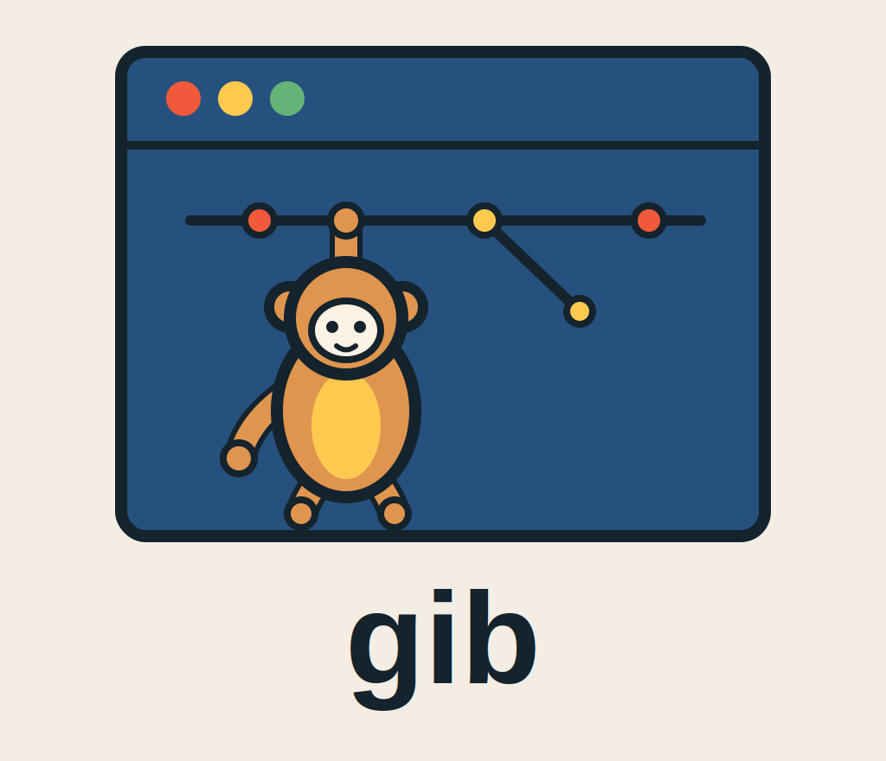

# GitBlend

[](https://github.com/NotTheRealWallyx/GitBlend/actions/workflows/ci_entrypoint.yml) [](https://www.codefactor.io/repository/github/nottherealwallyx/gitblend) [](https://codecov.io/gh/NotTheRealWallyx/GitBlend)



GitBlend (`gib` for short) is a Git utility tool that combines Git and GitHub commands to streamline your workflow. It provides a simple CLI interface for managing Git operations such as tags, commits, remotes, and multi-repo updates.

## Table of Contents

- [Features](#features)
- [Installation](#installation)
- [Usage](#usage)
  - [Available Commands](#available-commands)
- [Configuration](#configuration)
- [Uninstallation](#uninstallation)
- [License](#license)
- [Contributing](#contributing)

## Features

GitBlend is a versatile tool designed to simplify your Git and GitHub workflows. Here are some of the key features:

- **Tag Management**: Manage Git tags effortlessly with commands to create, delete, rename, and list tags. Whether you need to annotate a release, clean up old tags, or rename an existing tag, GitBlend provides a streamlined interface for these operations.
  - Create annotated tags with custom messages.
  - Push tags to remote repositories.
  - Delete tags both locally and remotely.
  - Rename tags while preserving their history.
  - List all tags in your repository.

- **Repository Management**: Keep your repositories up-to-date with the `update-all` command. This command:
  - Recursively finds all Git repositories on your computer.
  - Updates repositories to the latest changes on the `main` branch.
  - Optionally skips repositories with uncommitted changes or those not on the `main` branch.

- **Commit Management**: Simplify the process of creating commits with the `commit` command. This includes:
  - Adding all files to the commit with the `--add` flag.
  - Creating commits even when there are no changes using the `--allow-empty` flag.

- **Remote Management**: Easily manage your repository remotes with dedicated commands.
  - View all configured Git remotes and their URLs with a single command.
  - Change the URL of any remote (e.g., origin) directly from the CLI.

- **General Commands**: Access helpful utilities like:
  - Displaying the current version of GitBlend.
  - Viewing detailed help for all available commands.

## Installation

### Prerequisites

- Python 3.10 or higher
- [Poetry](https://python-poetry.org/) for dependency management
- [pipx](https://pypa.github.io/pipx/) for isolated Python package installations

### Steps

1. Clone the repository:

```bash
git clone https://github.com/NotTheRealWallyx/GitBlend.git
cd GitBlend
```

2. Run the installation script:

```bash
./install.sh
```

This script will:

- Build the package using Poetry.
- Install the package using pipx.

## Usage

After installation, use the `gib` command from your terminal, followed by the desired command:

```bash
gib list-tags
gib create-tag v1.2.0 --message "Release v1.2.0"
```

> **Note**: The full name `gitblend` also works as an alias for every command below, if you prefer to type it out.

### Available Commands

#### Tag Management

- `gib list-tags`: List all Git tags in the current repository.
- `gib create-tag <tag_name> --message "<tag_message>" [--push]`: Create a new Git tag with an optional push to the remote repository.
- `gib delete-tag <tag_name>`: Delete a Git tag both locally and remotely.
- `gib rename-tag <old_tag> <new_tag>`: Rename an existing Git tag both locally and remotely.

#### Remote Management

- `gib show-remotes`: Show all Git remotes for the current repository.
- `gib set-remote-url <remote> <url>`: Change the URL of a Git remote (e.g., origin).

#### Repository Management

- `gib update-all [--path <path>] [--only-clean]`: Update all Git repositories on your computer. Use `--only-clean` to skip repositories that are not on the `main` branch or have uncommitted changes.

#### Commit Management

- `gib commit "<commit_message>" [--add] [--sign] [--allow-empty]`: Create a new Git commit with a message (also accepted via `-m`/`--message`). Use `--add` to stage all files before committing, `--sign` to sign the commit with your GPG key, and `--allow-empty` to create a commit even when there are no changes. All three flags can be enabled by default via the [configuration file](#configuration).
- `gib revert <number_of_commits> [--push]`: Revert the last specified number of commits. Use `--push` to push the changes to the remote repository after reverting.

#### General

- `gib --help`: Show help information for the GitBlend CLI.
- `gib version`: Display the current version of GitBlend.
- `gib setup [--force]`: Interactively create the [configuration file](#configuration). Use `--force` to overwrite an existing one without asking.
- `gib self-update`: Pull the latest changes from the source repo and reinstall GitBlend.

## Configuration

GitBlend reads an optional configuration file at `~/.gitblend.toml` where you can set default behavior, so you don't have to pass the same flags on every invocation.

The easiest way to create it is running `gib setup`, which asks a few yes/no questions and writes the file for you (the install script also offers this on a fresh install). Alternatively, create it by hand:

```toml
[commit]
add = true         # Always stage all files before committing (same as --add)
sign = true        # Always sign commits with your GPG key (same as --sign)
allow_empty = true # Always allow empty commits (same as --allow-empty)
```

With the configuration above, these two commands are equivalent:

```bash
gib commit "My commit message"
gib commit -s -a -m "My commit message"
```

## Uninstallation

To uninstall GitBlend, run the uninstallation script:

```bash
./uninstall.sh
```

This script will:

1. Uninstall the package using pipx.
1. Clean up any residual build files.

## License

This project is licensed under the GNU GPL v3. See the LICENSE file for details.

## Contributing

Contributions are welcome! Feel free to open issues or submit pull requests. See [CONTRIBUTING.md](CONTRIBUTING.md) for setup instructions, code style guidelines, and the PR process.
